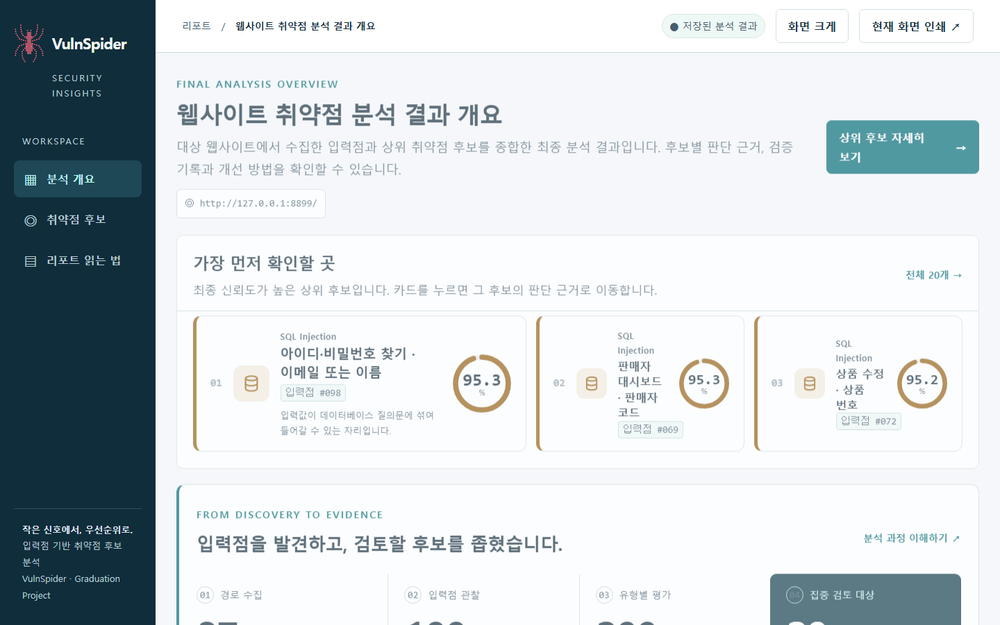
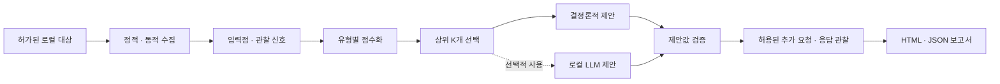

<div align="center">

<h1>🕷️ VulnSpider</h1>
<p><strong>입력점을 찾고, 점검할 후보의 우선순위를 정하고, 근거를 보여주는 웹 보안 분석 도구</strong></p>
<p>부산대학교 정보컴퓨터공학부 졸업과제 · 2026 · 44조 스파이더맨</p>
<p>
  
  
  
  
</p>
<p><strong>
  <a href="#1-프로젝트-소개">프로젝트 소개</a> ·
  <a href="#2-팀-소개">팀 소개</a> ·
  <a href="#3-시스템-구성도">시스템 구성도</a> ·
  <a href="#4-소개-및-시연-영상">소개 영상</a> ·
  <a href="#5-설치-및-사용법">설치 및 사용법</a> ·
  <a href="#6-평가-결과와-한계">평가 결과</a>
</strong></p>

</div>

---

> **한 문장으로:** VulnSpider는 웹사이트의 입력 위치를 수집해 SQL 삽입(SQLi), 반사형 XSS, 접근 권한 문제(BAC) 후보를 정리하고, 제한된 예산 안에서 먼저 확인할 대상을 선택해 그 근거를 HTML 보고서로 보여줍니다.



<div align="center"><sub>DemoShop 실습 환경을 대상으로 생성한 실제 HTML 보고서의 개요 화면</sub></div>

## 1. 프로젝트 소개

### 1.1. 배경과 필요성

웹 서비스의 입력은 URL의 쿼리뿐 아니라 HTML 양식, JavaScript 실행 뒤의 요청, 인증된 화면 등 여러 곳에 존재합니다. 점검 대상이 많아질수록 모든 입력에 같은 비용을 쓰기 어렵고, 높은 점수가 나온 이유를 알 수 없다면 결과를 검토하기도 어렵습니다.

VulnSpider는 **입력점 발견 → 관찰 신호 수집 → 후보 우선순위화 → 상위 후보 추가 확인 → 결과 설명**을 한 흐름으로 연결합니다. 대상의 모든 취약점을 자동으로 확정하는 것이 아니라, 사람이 먼저 살펴볼 후보와 판단 근거를 제공하는 졸업과제 결과물입니다.

### 1.2. 개발 목표

| 단계 | 하는 일 | 사용자가 받는 결과 |
| :--- | :--- | :--- |
| **발견** | 정적 HTML과 제한된 브라우저 동작에서 입력점 수집 | 입력 위치와 발견 경로 |
| **우선순위** | SQLi·반사형 XSS·BAC 관련 신호를 유형별로 평가 | 근거가 연결된 상위 후보와 보류 후보 |
| **선택적 확인** | 선택된 후보에만 허용된 변형 요청 실행 | 추가 관찰 결과와 검증 전후 신뢰도 |
| **보고** | 수집·선택·검증 기록을 하나의 화면에 연결 | 오프라인에서 열 수 있는 HTML 대시보드와 JSON 산출물 |

### 1.3. 기존 방식과의 차별점

- **URL이 아닌 입력점 중심:** 페이지, 요청 대상, 입력 위치, 취약 유형을 별도 단위로 다룹니다. 같은 입력이 여러 수집 경로에서 발견되면 출처를 보존하며 정리합니다.
- **검증 예산을 우선순위에 사용:** 모든 후보를 동일하게 재검사하는 대신 상위 K개를 선택하고, 선택되지 않은 후보도 보고서에 남깁니다.
- **제안과 판정을 분리:** 로컬 LLM을 사용할 때에도 제안값은 결정론적 검증기를 통과해야 실행됩니다. 모델 출력만으로 취약점을 확정하지 않습니다.
- **설명 가능한 결과:** 점수, 관찰 신호, 실행 여부, 검증 후 변화와 제한 사항을 보고서에서 함께 확인할 수 있습니다.

### 1.4. 활용 가치와 범위

보안 실습과 개발 교육에서 제한된 시간·요청 수로 어떤 입력부터 확인할지 설명하는 데 활용할 수 있습니다. 현재 구현과 평가는 **허가된 로컬 실습 대상**을 기준으로 하며, 실제 서비스의 무단 점검이나 취약점 확정을 목적으로 하지 않습니다.

## 2. 팀 소개

**스파이더맨 · 44조**

| 구성원 | 담당 | 주요 기여 | 연락처 |
| :--- | :--- | :--- | :--- |
| **전상현** · 팀장 | 시스템 기반·수집·통합 | 공통 도메인 모델, Legacy Adapter, CLI·파이프라인, 정적·동적 수집, 범위·요청 예산 제어와 통합 테스트 | [jsh4360@pusan.ac.kr](mailto:jsh4360@pusan.ac.kr) |
| **한수훈** | 신호 분석·우선순위·평가 | SQLi·XSS·BAC 신호와 점수화, 보정 확률·Top-K, DemoShop 평가, 검증 신뢰도, HTML·JSON 보고 | [tngns4426@pusan.ac.kr](mailto:tngns4426@pusan.ac.kr) |
| **이석현** | 로컬 LLM·제안값 검증 | 검증값 패턴과 프롬프트, Qwen2.5 계열 모델 준비, 제안값 검증기와 추가 확인 연동, SPA 수집 보완 | [esbg5095@pusan.ac.kr](mailto:esbg5095@pusan.ac.kr) |

## 3. 시스템 구성도

### 3.1. 전체 흐름



1. **수집:** 대상의 정적 문서와 허용된 브라우저 동작을 관찰해 입력점을 찾습니다.
2. **정리·평가:** 입력점과 취약 유형을 결합하고, 실제 관찰 신호로 후보의 우선순위를 계산합니다.
3. **선택:** 상위 K개만 추가 확인 대상으로 고릅니다. 보류 후보도 별도로 기록합니다.
4. **확인:** 결정론적 방식 또는 선택적으로 로컬 LLM이 변형값을 제안합니다. 제안값 검증과 HTTP 응답 관찰은 별도 단계입니다.
5. **보고:** 최종 HTML 대시보드에서 후보의 위치, 근거, 실행 상태와 검증 전후 변화를 확인합니다.

### 3.2. 기술 구성

| 영역 | 기술과 역할 |
| :--- | :--- |
| 실행 환경 | Python 3.11 이상, 명령줄 인터페이스(`vulnspider`) |
| 수집 | Python 기반 정적 수집, 선택적 Playwright 브라우저 수집 |
| 분석 | 입력점별 프로브·특징 추출, SQLi·XSS·BAC 점수화, 보정 확률과 Top-K 선택 |
| 추가 확인 | 제안값 검증기, 결정론적 제안기, 선택적 로컬 GGUF 모델 연동 |
| 결과 | JSON 산출물, 단일 파일 HTML 대시보드와 상세 검증 보고서 |

로컬 LLM 모델 파일은 저장소에 포함하지 않습니다. **기본 실행에는 LLM이 필요하지 않습니다.** 개발 과정의 설계 배경은 [아키텍처 문서](docs/ARCHITECTURE.md)에, 현재 CLI 옵션은 `vulnspider --help`에 정리되어 있습니다.

### 3.3. 점수와 판정의 의미

멘토링에서 지적된 점수 개념의 혼동을 피하기 위해 세 값을 구분합니다. **`RankScore`는 어느 후보를 먼저 확인할지 정하는 우선순위 점수**이고, **보정 확률은 추가 검증 전 후보를 선택하는 데 쓰는 추정값**입니다. **검증 후 신뢰도는 실제 추가 관찰을 반영한 결과값**입니다. 어느 값도 운영 환경에서의 확정적인 위험도나 취약점 판정으로 해석하지 않습니다.

### 3.4. 주요 디렉터리

```text
VulnSpider/
├─ src/vulnspider/       # CLI, 수집, 분석, 선택, 검증, 보고
├─ data/                 # 실습 대상의 정답 자료와 보정 데이터
├─ docs/                 # 설계 문서, 실험 결과, README 이미지
├─ models/               # 선택적 로컬 모델 사용 안내
├─ tests/                # 단위·통합 테스트
├─ tools/                # 평가 및 개발 보조 도구
├─ demo_target_server.py # 로컬 DemoShop 실습 서버
└─ pyproject.toml         # 패키지와 의존성 정의
```

## 4. 소개 및 시연 영상

<div align="center">

<a href="https://www.youtube.com/watch?v=OQXbc5ClzOM"></a>
<p><strong><a href="https://www.youtube.com/watch?v=OQXbc5ClzOM">▶ 2026 전기 졸업과제 44 스파이더맨</a></strong></p>

</div>

영상에서는 웹 입력점 수집부터 후보 우선순위화, 선택적 확인, 결과 보고까지의 흐름을 볼 수 있습니다.

## 5. 설치 및 사용법

### 5.1. 준비 사항

- **Python 3.11 이상**
- 브라우저 기반 동적 수집을 사용할 경우 **Playwright와 Chromium**
- 점검 권한이 있는 **로컬 실습 대상**. 아래 예시는 저장소의 DemoShop 서버를 사용합니다.

### 5.2. 설치

저장소를 내려받은 뒤 루트 디렉터리에서 실행합니다. **Windows PowerShell**에서는 다음 명령을 사용합니다.

```powershell
python -m venv .venv
.\.venv\Scripts\python.exe -m pip install -e ".[dynamic]"
.\.venv\Scripts\python.exe -m playwright install chromium
```

macOS/Linux에서는 `.venv/bin/python`을 사용합니다.

```bash
python3 -m venv .venv
./.venv/bin/python -m pip install -e ".[dynamic]"
./.venv/bin/python -m playwright install chromium
```

동적 수집을 사용하지 않을 경우 `".[dynamic]"` 대신 `.`만 설치한 뒤 `--static-only`로 실행할 수 있습니다.

### 5.3. 로컬 DemoShop 실행

아래 예시는 가상환경을 활성화한 터미널을 기준으로 합니다. Windows PowerShell에서는 `.\.venv\Scripts\Activate.ps1`, macOS/Linux에서는 `source .venv/bin/activate`를 실행하세요. 새 터미널을 열면 다시 활성화해야 합니다.

**터미널 1 — 실습 서버**

```bash
python demo_target_server.py
```

브라우저에서 `http://127.0.0.1:8899/`를 열어 실습 대상을 확인합니다.

**터미널 2 — 수집·분석·선택적 확인**

```bash
vulnspider -u http://127.0.0.1:8899/ --verify
```

실행한 디렉터리에 `vulnspider-report.html`과 수집·분석 JSON이 생성됩니다. `--verify`를 사용하면 검증 기록과 상세 보고서도 생성됩니다. HTML 파일은 웹 서버 없이 브라우저에서 열 수 있습니다.

| 필요한 동작 | 예시 |
| :--- | :--- |
| 정적 수집만 실행 | `vulnspider -u http://127.0.0.1:8899/ --static-only` |
| 상위 후보 수 지정 | `vulnspider -u http://127.0.0.1:8899/ -k 20 --verify` |
| CLI 시작 로고 숨기기 | `vulnspider -u http://127.0.0.1:8899/ --no-banner` |
| 전체 옵션 확인 | `vulnspider --help` |

실제 URL을 점검할 때에는 소유자에게 허가받은 대상과 허용 범위를 사용하세요. 현재 기본 정책은 로컬·루프백 실습 환경을 대상으로 합니다.

## 6. 평가 결과와 한계

### 6.1. DemoShop 우선순위 평가

[저장소에 보관된 평가 자료](docs/results/demoshop/evaluation-table.md)는 DemoShop 공개 영역의 **후보 200개, 양성 32개**를 대상으로 합니다. 해당 실행에서 선택적 확인을 포함한 방식의 상위 20개 결과는 다음과 같습니다.

| 지표 | Top-20 결과 | 의미 |
| :--- | ---: | :--- |
| Precision@20 | **0.800** | 상위 20개 중 양성 비율 |
| Recall@20 | **0.500** | 전체 양성 중 상위 20개에 포함된 비율 |

인증 영역의 BAC는 [별도 실행 자료](docs/results/demoshop-bac/evaluation-table.md)로 평가했습니다. 공개 영역과 인증 영역은 조건이 달라 결과를 합산하지 않습니다.

### 6.2. 해석할 때 주의할 점

- 결과의 점수와 `SUPPORTED` 표시는 **후속 검토의 우선순위와 관찰 근거**입니다. 실제 공격 성공이나 모든 취약점의 발견을 보증하지 않습니다.
- DemoShop은 팀이 만든 통제된 실습 환경입니다. 다른 웹사이트에서도 같은 성능이 나온다고 일반화할 수 없습니다.
- 로컬 LLM 제안기는 선택 사항이며, 이번 평가에서 결정론적 방식보다 우선순위 성능이 높아졌다고 주장하지 않습니다.

### 6.3. 산업체 멘토링 의견과 반영

| 자문 의견 | 반영 내용과 현재 범위 |
| :--- | :--- |
| 핵심 알고리즘 코드보다 인터페이스의 흐름을 보여주는 그림이 직관적임 | [전체 흐름도](#31-전체-흐름)와 단계별 입출력 설명을 README에 추가했습니다. |
| 정규화 점수와 최종 위험도의 개념 차이를 명확히 할 필요가 있음 | [점수와 판정의 의미](#33-점수와-판정의-의미)에서 우선순위 점수, 검증 전 보정 확률, 검증 후 신뢰도를 구분했습니다. |
| 동적 파라미터 수집 인터페이스를 완성할 필요가 있음 | 정적·브라우저 수집 결과 병합, 허용된 GET 요청 관찰, 제한된 POST JSON의 구조 관찰을 구현했습니다. 정책에서 읽기 전용으로 허용한 POST JSON만 제한된 예산으로 선택적 프로브를 실행하며, 그 밖의 관찰 대상 POST JSON은 구조만 기록하고 재전송하지 않습니다. |
| 정량적 평가 지표가 필요함 | [DemoShop 평가 자료](docs/results/demoshop/evaluation-table.md)에 Precision·Recall·MAP·NDCG와 무작위 기준을 기록했습니다. |
| 휴리스틱 가중치를 최적화된 수치로 정할 필요가 있음 | 보정 확률과 검증 신뢰도 모델은 도입했지만, 휴리스틱 가중치의 최적화 완료는 입증하지 못했습니다. 후속 연구 과제로 남깁니다. |

## 7. 문서와 참고 자료

- [설계·개발 기록](docs/ARCHITECTURE.md) · [평가 절차](docs/EVALUATION_PROTOCOL.md)
- [실험 결과 묶음](docs/results/README.md) · [DVWA 실습 결과](docs/DVWA_TEST_RESULTS.md)
- [OWASP Web Security Testing Guide](https://owasp.org/www-project-web-security-testing-guide/)
- [부산대학교 2026 졸업과제 저장소 템플릿](https://github.com/pnucse-capstone2026/Capstone-Template-2026)

---

<div align="center"><sub>VulnSpider · 부산대학교 정보컴퓨터공학부 · 2026 졸업과제</sub></div>
